Qi-Jun Hong 

Projection made on Janurary 19, 2021 

[Source](https://github.com/qjhong/covid19)

This is a personal project and these are my own views.
  Covid19 Encounter Model by Qi-Jun Hong is licensed under a <a rel="license" href="http://creativecommons.org/licenses/by/4.0/">Creative Commons Attribution 4.0 International License</a>. Based on a work at <a xmlns:dct="http://purl.org/dc/terms/" href="https://github.com/qjhong/covid19" rel="dct:source">https://github.com/qjhong/covid19</a>.

## Projection summary
* My model projects flat curves of cases and deaths over the next few weeks in the US.
* Fatality will peak in early February. The peak is at 3000-3500 deaths/day, with single day max above 4000.

## States at risk:
See figure below "Daily New Cases in 50 US States". States at risk are colored in red.

## Next 10 days
Top 5 States by Daily New Cases
* Next Day January 20: CA(39593), TX(23332), NY(16248), FL(12914), AZ(7870)
* In 5 Days January 24: CA(38993), TX(25226), NY(17362), FL(12846), NC(7369)
* In 10 Days January 29: CA(36973), TX(26742), NY(17929), FL(12670), NC(7268)

## Projection of the Next 60 Days
### State Projection:
[AK](AK.html)
[AL](AL.html)
[AR](AR.html)
[AZ](AZ.html)
[CA](CA.html)
[CO](CO.html)
[CT](CT.html)
[DC](DC.html)
[DE](DE.html)
[FL](FL.html)
[GA](GA.html)
[HI](HI.html)
[IA](IA.html)
[ID](ID.html)
[IL](IL.html)
[IN](IN.html)
[KS](KS.html)
[KY](KY.html)
[LA](LA.html)
[MA](MA.html)
[MD](MD.html)
[ME](ME.html)
[MI](MI.html)
[MN](MN.html)
[MO](MO.html)
[MS](MS.html)
[MT](MT.html)
[NC](NC.html)
[ND](ND.html)
[NE](NE.html)
[NH](NH.html)
[NJ](NJ.html)
[NM](NM.html)
[NV](NV.html)
[NY](NY.html)
[OH](OH.html)
[OK](OK.html)
[OR](OR.html)
[PA](PA.html)
[RI](RI.html)
[SC](SC.html)
[SD](SD.html)
[TN](TN.html)
[TX](TX.html)
[US](US.html)
[UT](UT.html)
[VA](VA.html)
[VT](VT.html)
[WA](WA.html)
[WI](WI.html)
[WV](WV.html)
[WY](WY.html)

### Daily new confirmed cases:
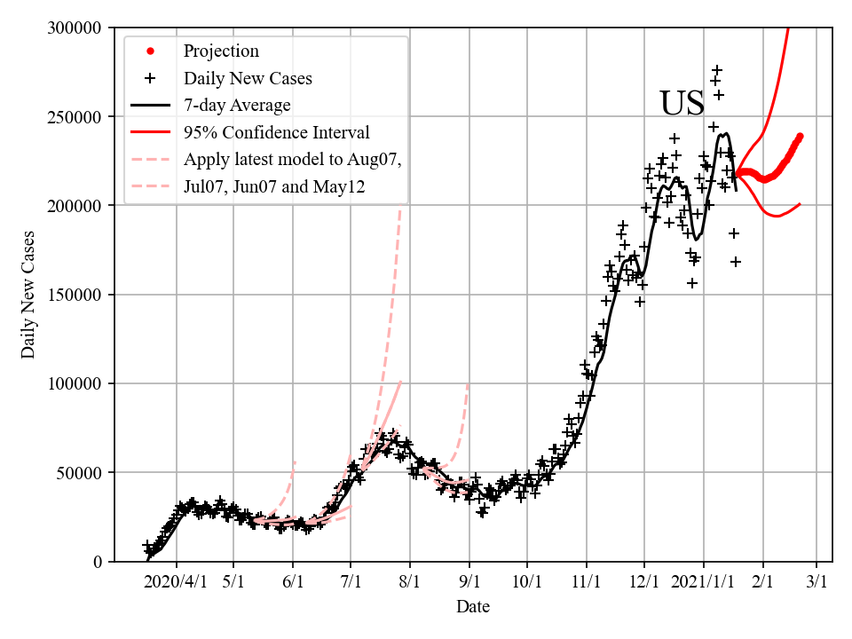
### Total deaths:
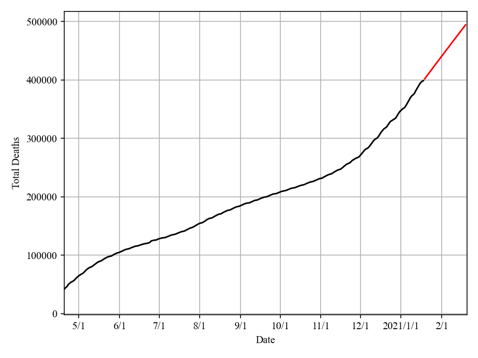
### Daily deaths:
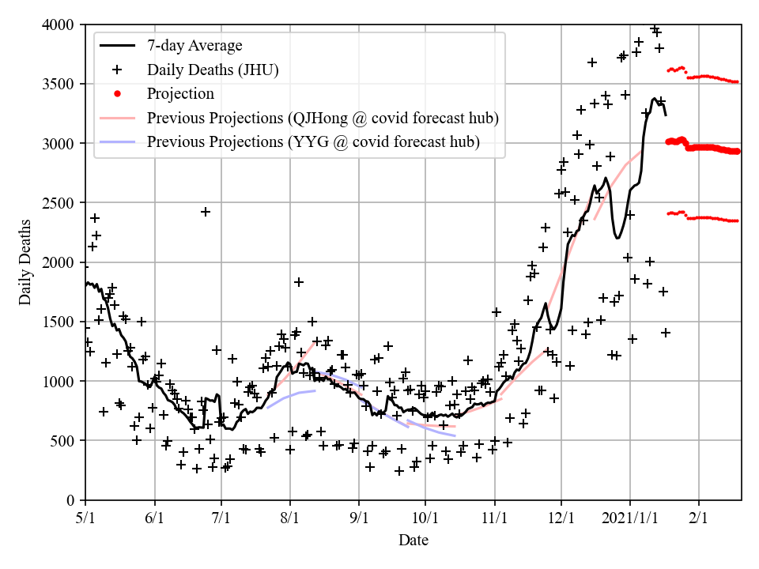
### Fatality rate Poisson weighted:
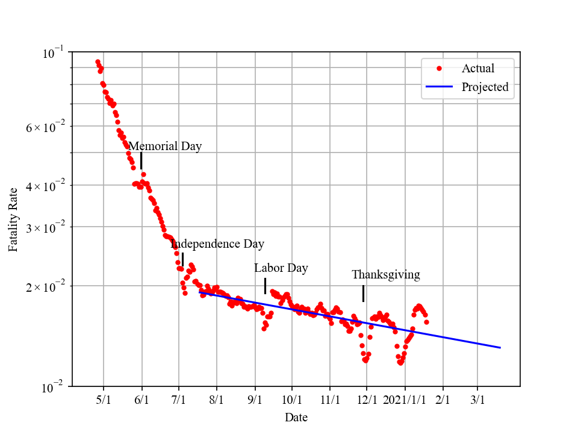
### Reproductive number:
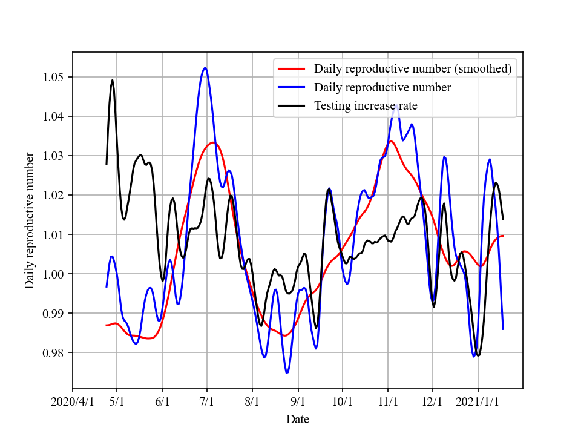

### My Model's Ranking by Youyang Gu:
[YYG's Evaluation](https://github.com/youyanggu/covid19-forecast-hub-evaluation/tree/master/summary)

[My Summary](https://github.com/qjhong/covid19-forecast-hub-evaluation-summary-hqj)

On Nov 2, Youyang Gu slightly changed his ranking method. For transparency, I keep ranking results both before and after the change. (See Nov 02 link at top of page)

If we compare median/mean ranking, my model is at the top of the list, regardless of the change.

Starting the next update, I will post ranking only using the new method (since this is Youyang Gu's ranking evaluation).

#### Weekly ranking, 1-6w forward performance
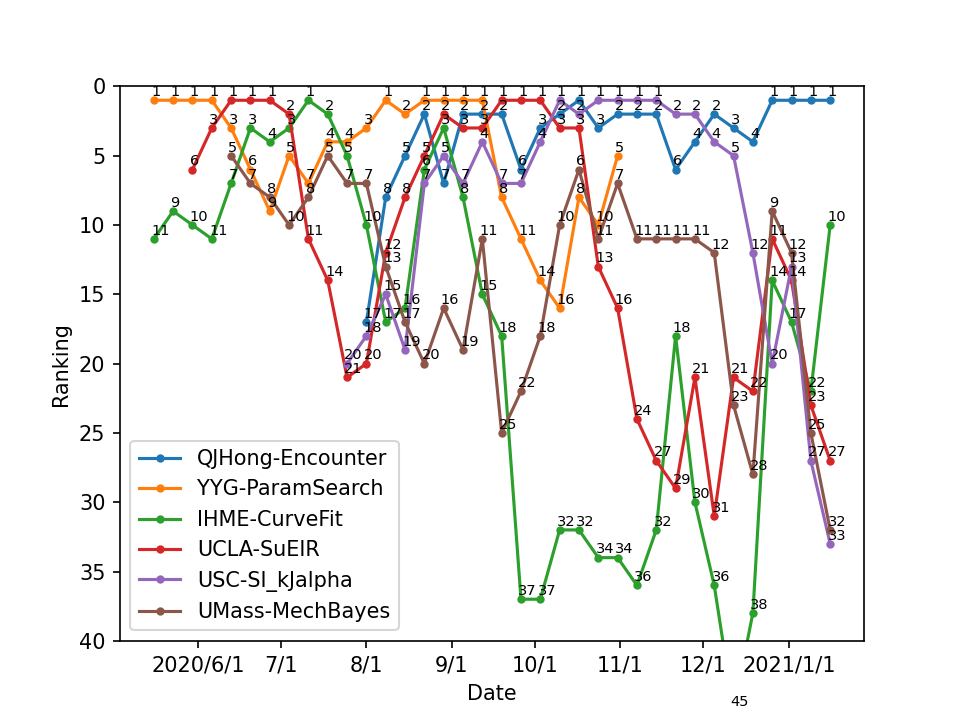
#### Overall ranking and RMSE/MAE of errors
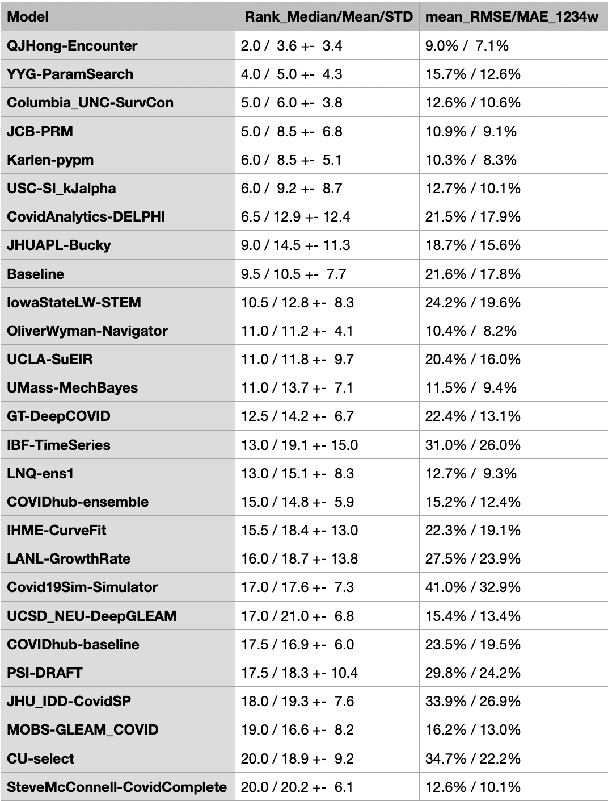

### Daily Tests and Daily New Cases
(Data source: the COVID Tracking Project)

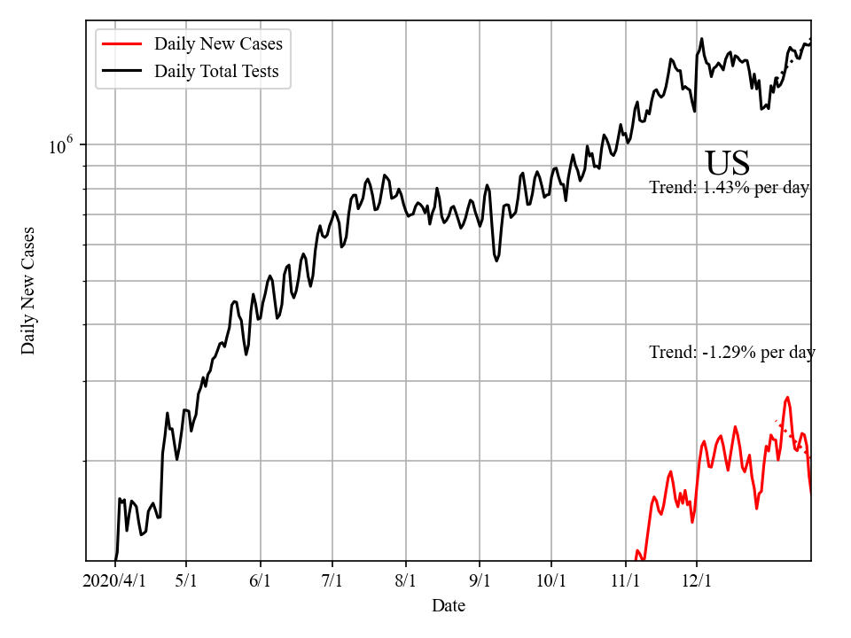
### Daily New Cases in 50 US States
(Data source: the COVID Tracking Project)
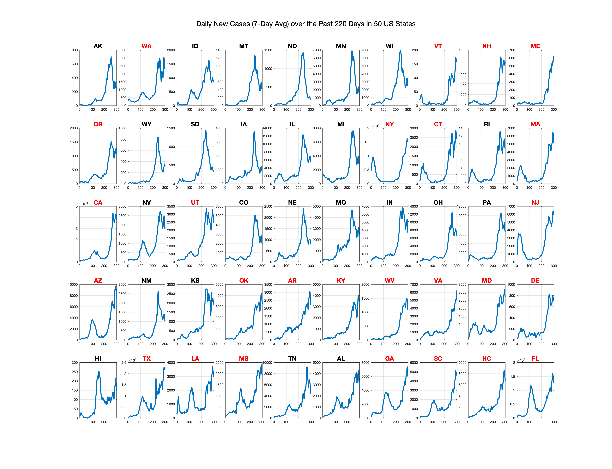

### What is the idea?

 UPDATE: Since Oct 12, my model has included more features, in addition to encounter density. XGBoost is employed for regression.

today's "Daily New Confirmed Cases" + today's "Encounter Density" ==> today's newly infected Cases ==> next 2-3 weeks' "Daily New Confirmed Cases"

(Encounter Density <i>D</i> data source: Unacast's Social Distancing Scoreboard, which analyzes cell phone location data, counts "Human Encounters", defined as two cell phone devices that were in the same place at the same time, and then derives the probability and "Encounter Density".)

My model uses current "Encounter Density" <i>D</i> to predict future "Reproductive Number" <i>R</i> and "Daily New Confirmed Cases". This is the most fundamental idea and assumption in this model.

<h3>Why "Encounter" data?</h3>

Daily New Confirmed Cases data is "outdated". People who get confirmed today were infected days ago through "Human Encounter" with other contagious people, and it took days to develop symptoms, seek tests, and get confirmed (infected -> symptomatic -> tested -> confirmed). In other words, today's "Daily New Confirmed Cases" is outdated data and it can be inferred from past "Daily New Confirmed Cases" data + past "Encounter" data. 

Encounter data is up-to-date. Typically yesterday's Human Encounter Density data is available online today. (Encounter Density <i>D</i> data source: Unacast's Social Distancing Scoreboard, which analyzes cell phone location data, counts "Human Encounters", defined as two cell phone devices that were in the same place at the same time, and then derives the probability and "Encounter Density".)

<h3>How does it work?</h3>
<h3></h3>

The strong correlation between <i>R</i> and <i>D</i> (<i>D</i> is shifted by ~22 days) is evident in this figure. While social distancing quickly brought down <i>R</i>, easing policy is slowly increasing <i>R</i> back above 1. 

Using (1) <i>R</i> and <i>D</i> relation in the past as a training set, (2) future <i>D</i> as input, and (3) machine learning / regression, my model can predict future <i>R</i>, and ultimately future Daily New Cases.

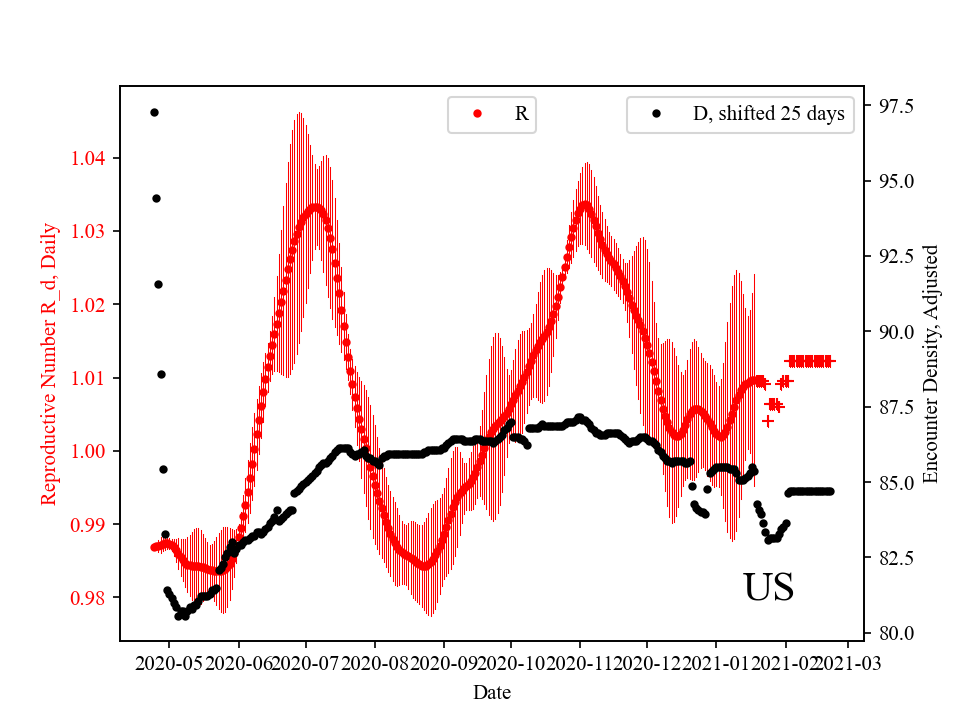

Shown in red is "Daily Reproductive Number" <i>R_d</i>, which is obtained through fitting of existing "Daily New Confirmed Cases". By definition, if day 1 daily new cases in <i>N</i>, day 2 number will be <i>N*R_d</i>. Hence, the ultimate goal is to keep <i>R_d</i> under 1.

The black dots are Adjusted Encounter Density <i>D_adj</i>, shifted forward by ~22 days.
These two curves are remarkably close. For example, <i>R</i> started to quickly decrease at around 3/20. This coincides with a sudden decrease of <i>D</i> at the end of Feb, ~20 days before. <i>R</i> reached bottom at ~4/15 and stayed at the level till ~5/15. This overlaps with low <i>D</i> between 3/20 to 4/20.
The amount of shift is optimized to maximize overlap, and the value is determined as ~22 days.
The values are normalized to pre-pandamic levels, so 1.0 means activity level before pandemic hit US.

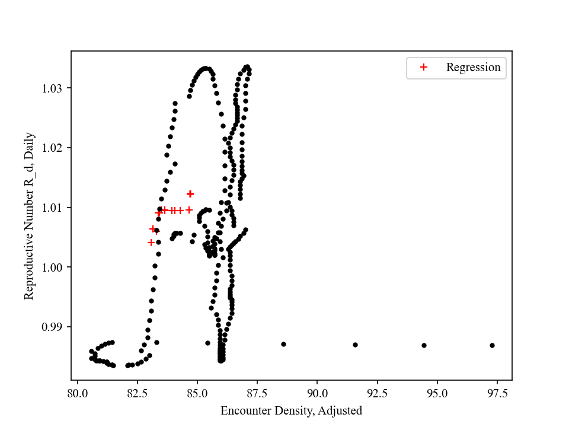
